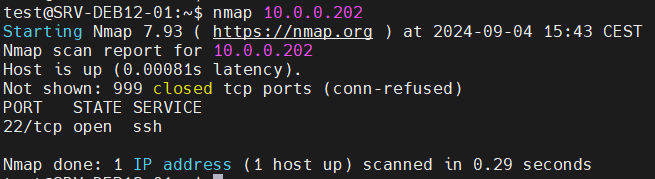
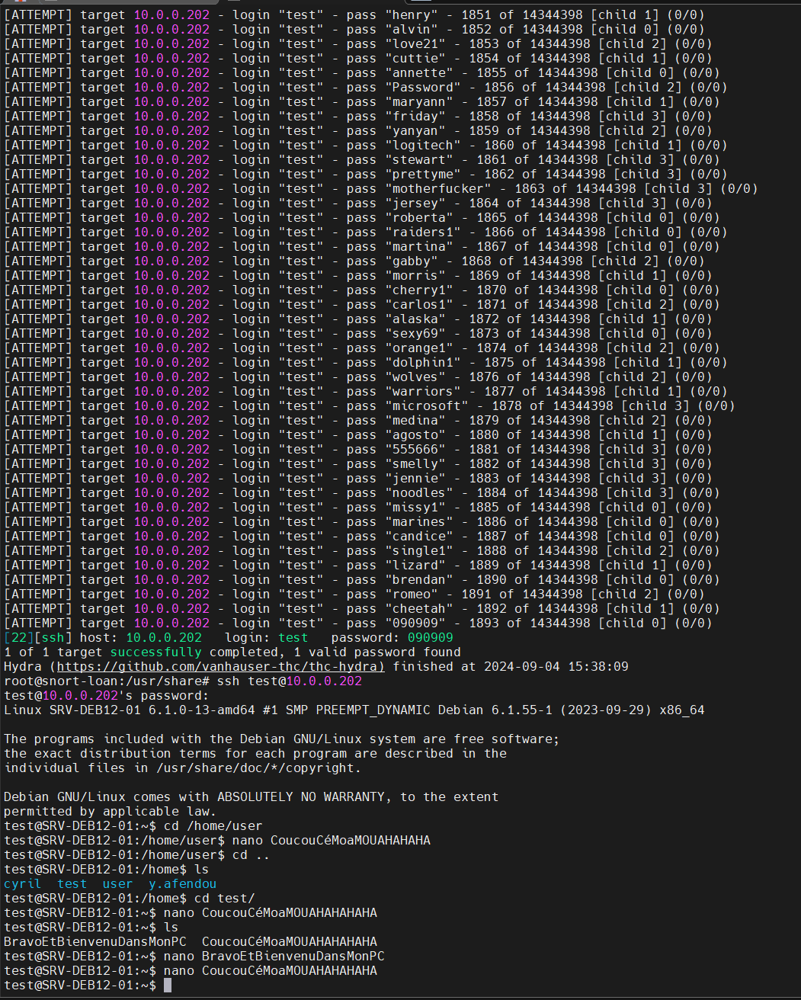

# Attaque

## Nmap

Ici on peut voir que le port 22 est ouvert et c'est le seul qui est ouvert !

## BruteForce

Ici on peut voir que le bruteforce sur le port *22* avec l'utilisateur *test* a bien fonctionné : 

