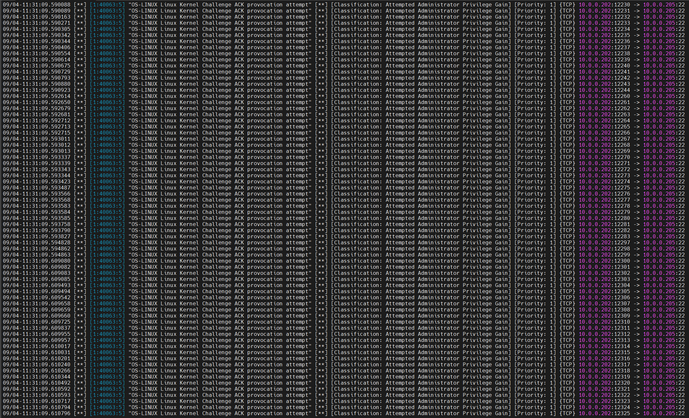
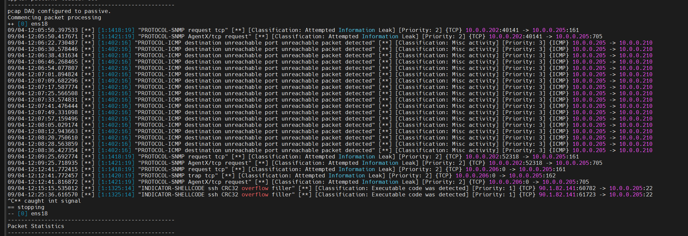

# Défense avec Snort3

## Première attaque

On peut voir ci-dessous que Snort nous remonte bien les informations demandé dans local.rules

## Deuxième attaque

Et ici on peut voir la deuxième et dernière attaque (les dernières infos c'est mois qui m'attaque avec hping3)

