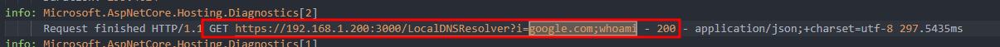

# Timeline Forensic - 18/03/2025

|Élément                                            |Images                                                                                                                                         |Horodatage                  |
|:--------------------------------------------------|:---------------------------------------------------------------------------------------------------------------------------------------------:|:--------------------------:|
| Scan nmap                                         |                                                                                                         | `02/10/2024 13h26`         |
| Injection SQLi réussie                            |                                                                                        | `02/10/2024 13h26`         |
| Vol du token application                          |                                                                       | `02/10/2024 13h26`         |
| Injection de commande -> `whoami`                 |                                                                                                                 | `02/10/2024 13h26`         |
| Injection de commande -> ajout de `bob`           |                                                                                                    | `02/10/2024 13h26`         |
| Tentative de mot de passe pour `bob` : **échec**  |                                                                                        | `02/10/2024 13h31`         |
| Mot de passe pour `bob` : **succès**              |                                                                                       | `02/10/2024 13h36`         |
| Connexion SSH de `bob`                            |                                                                                      | `02/10/2024 13h36`         |
| Backdoor opérationnelle *(compromission système)* |                                                                             | `02/10/2024 13h36 - 13h40` |
| Installation SSH                                  |                                                                                           | `02/10/2024 13h26`         |
| Connexion SSH en locale                           |                                                                         | `02/10/2024 13h36`         |
| Activité système liée                             |   | `02/10/2024 13h26 - 13h40` |