# Report Vulnerable Light App
---
## 0. Vulnerability classification scale

> ANSSI offers a classification scale for vulnerabilities based on the risk they present for the information system. This classification takes into account the impact of the vulnerability on the system and the difficulty of exploitation. Risk levels are defined as follows :

1. Ease of Operation:
- 🟢 **Easy**: Simple operation, without any special tools.
- 🟡 **Moderate**: Exploitation requiring simple techniques and publicly available tools.
- 🟠 **High**: Exploitation of public vulnerabilities requiring information systems security skills and the development of simple tools.
- 🔴 **Difficult**: Exploitation of unpublished vulnerabilities requiring expertise in information systems security and the development of specific and targeted tools.

2. Impact :
- 🟢 **Minor**: No direct consequence on the security of the audited information system.
- 🟡 **Important**: Isolated consequences on specific points of the audited information system.
- 🟠 **Major**: Restricted consequences on part of the audited information system.
- 🔴 **Critical**: Widespread consequences across the entire audited information system.

3. Risk Levels:
- 🟢 **Minor**: Low risk to the information system. May require correction.
- 🟡 **Important**: Moderate risk on the information system.
    - Requires medium-term correction.
- 🟠 **Major**: Major risk to the information system.
    - Requires short-term correction.
- 🔴 **Critical**: Critical risk on the information system.
    - Requires immediate correction or requires immediate termination of service.

---
## 1. Vulnerability table

| Check or not | CWE | Description | Impact | Working | Risk level |
|:------------:|:---:|-------------|:------:|:-------:|:----------:|
| ✅ | CWE-~~22~~ 23 | Path Traversal | 🟠Major | 🟢Easy | 🔴**CRITICAL** |
| ✅ | CWE-78 | OS Command Injection | 🟠Major | 🟢Easy | 🔴**CRITICAL** |
| ✅ | CWE-79 | Cross-site Scripting | 🟠Major | 🟢Easy | 🔴**CRITICAL** |
| ✅ | CWE-89 | SQL Injection | 🟠Major | 🟢Easy | 🔴**CRITICAL** |
| ✅ | CWE-94 | Code Injection | 🟠Major | 🟢Easy | 🔴**CRITICAL** |
| ✅ | CWE-91 | XML Injection | 🟠Major | 🟢Easy | 🔴**CRITICAL** |
| ❌ | CWE-98 | Remote File Inclusion | / | / | / |
| ❌ | CWE-184 | Incomplete List of Disallowed Inputs | / | / | / |
| ✅ | + CWE-200[^1] | Exposure of Sensitive Information to an Unauthorized Actor | 🟠Major | 🟢Easy | 🔴**CRITICAL** |
| ❌ | CWE-213 | Exposure of Sensitive Information Due to Incompatible Policies | / | / | / |
| ✅ | CWE-284 | Improper Access Control | 🔴Critical | 🟡Moderate | 🔴**CRITICAL** |
| ✅ | CWE-287 | Improper Authentication | 🔴Critical | 🟠High | 🟠Major |
| ✅ | CWE-319 | Cleartext Transmission of Sensitive Information | 🟠Major | 🟡Moderate | 🟠Major |
| ❌ | CWE-326 | Inadequate Encryption Strength | / | / | / |
| ✅ | CWE-434 | Unrestricted Upload of File with Dangerous Type | 🔴Critical | 🟠High | 🟠Major |
| ✅ | CWE-502 | Deserialization of Untrusted Data | / | / | / |
| ❌ | CWE-521 | Weak Password Requirements | / | / | / |
| ❌ | CWE-532 | Insertion of Sensitive Information into Log File | / | / | / |
| ✅ | CWE 639 | Insecure Direct Object Reference | 🔴Critical | 🟡Moderate | 🔴**CRITICAL** |
| ❌ | CWE-611 | Improper Restriction of XML External Entity Reference | / | / | / |
| ❌ | CWE-787 | Out-of-bounds Write | / | / | / |
| ✅ | CWE-798 | Use of Hard-coded Credentials | 🟠Major | 🟡Important | 🟠Major |
| ❌ | CWE-829 | Local file Inclusion | / | / | / |
| ✅ | CWE-918 | Server-Side Request Forgery (SSRF) | 🟠Major | 🟠High | 🟠Major |
| ❌ | CWE-1270 | Generation of Incorrect Security Tokens | / | / | / |
| ❌ | CWE-1395 | Dependency on Vulnerable Third-Party Component | / | / | / |

## 2. Screen of our tests

| CWE | Request | Response |
|:---:|:-------:|:--------:|
| CWE-23 | 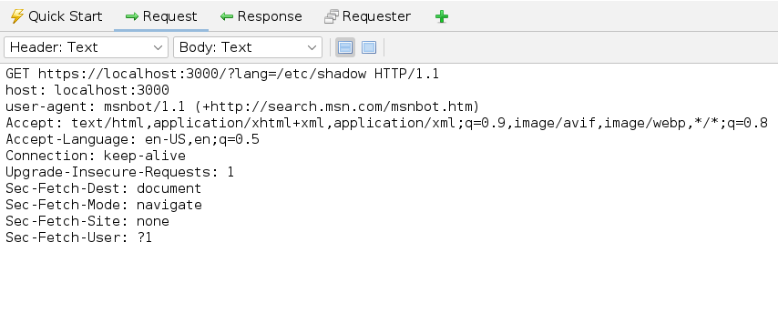 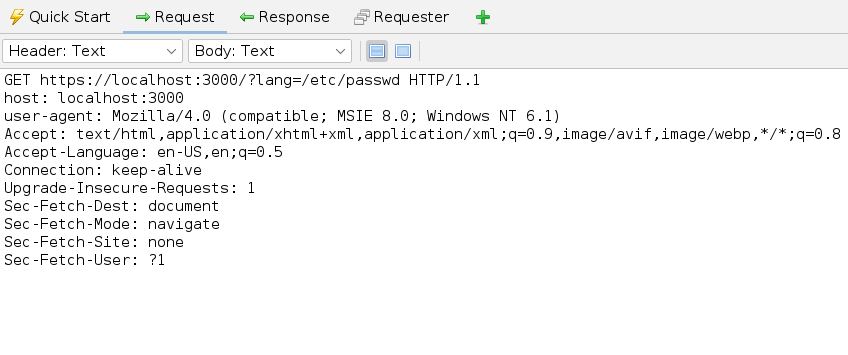 | 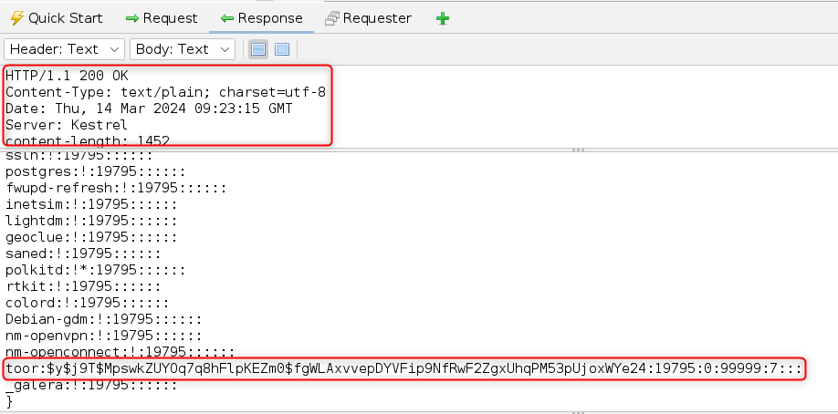 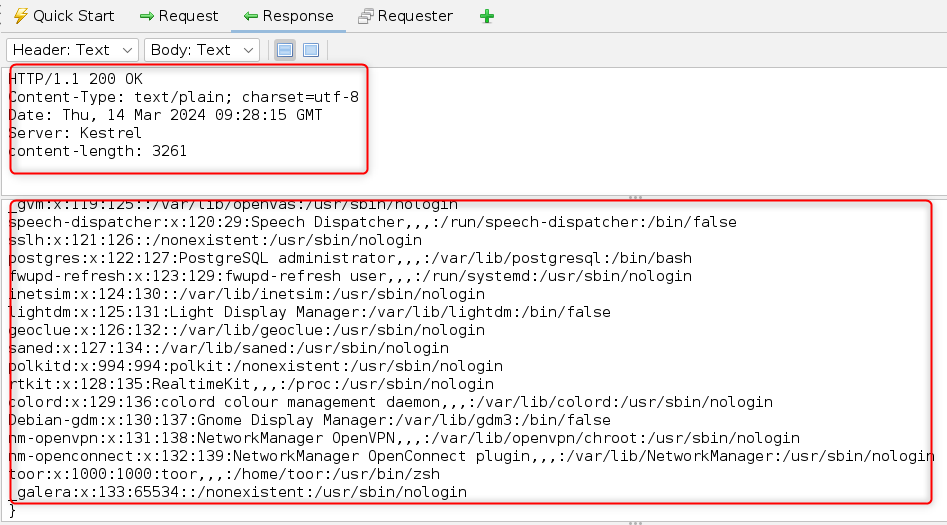 |
| CWE-78 |   |   |
| CWE-79 | 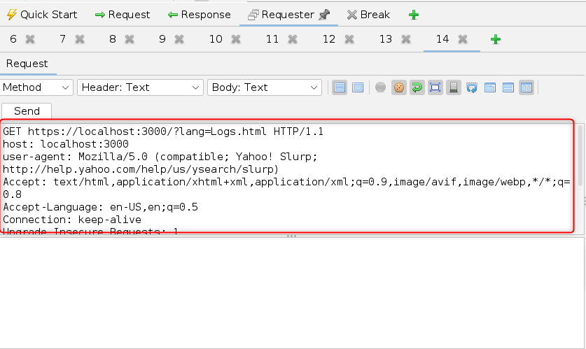 |  |
| CWE-89 | 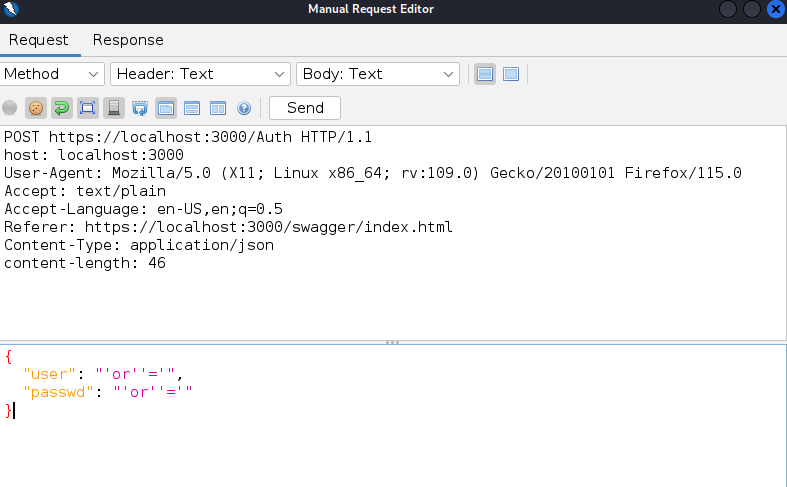 | 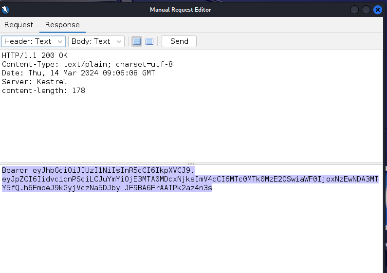 |
| CWE-94 |  |  |
| CWE-91 | 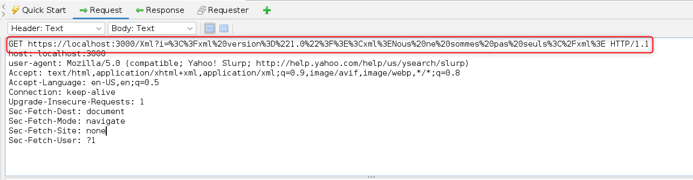 |  |
| CWE-200 |  | 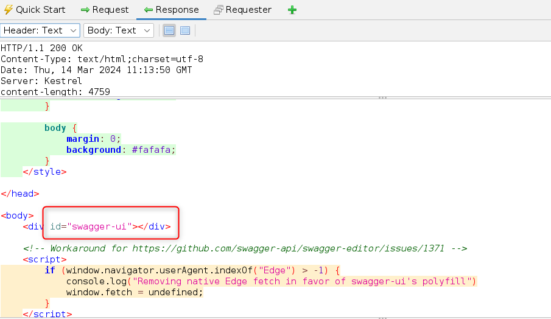 |
| CWE-284 | 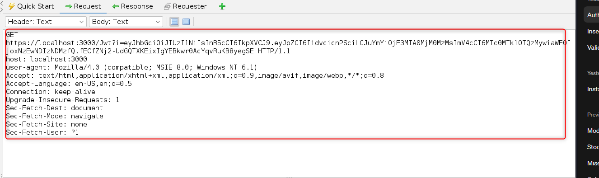 | 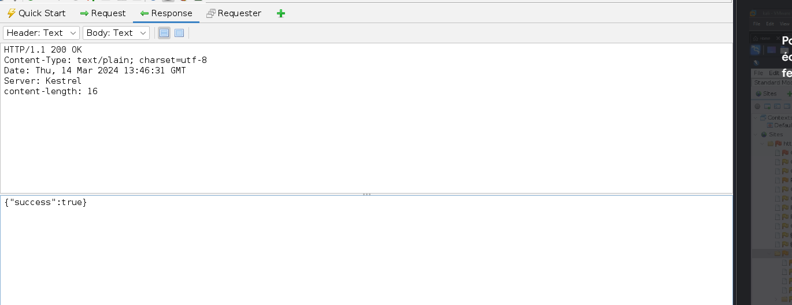 |
| CWE-287 | 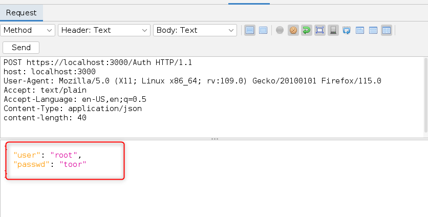 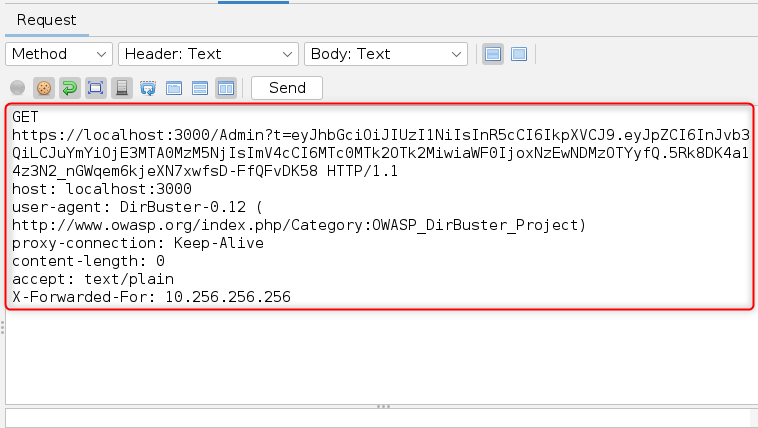 | 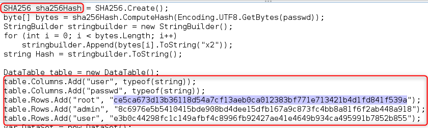 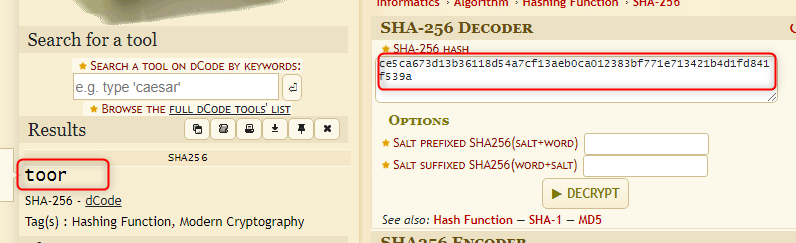 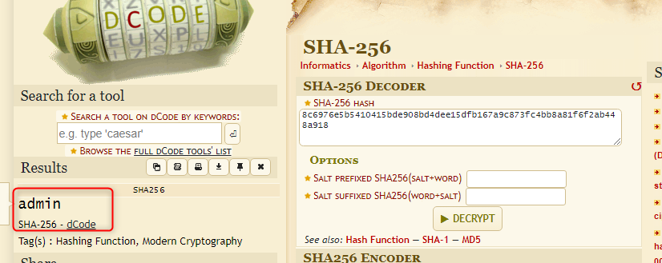 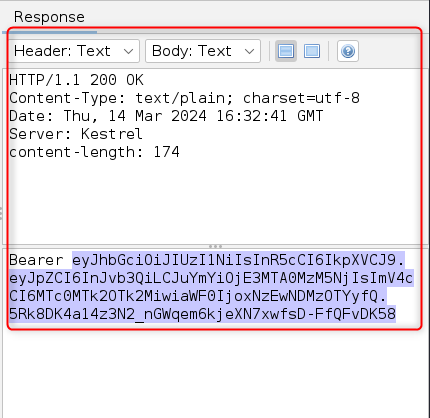 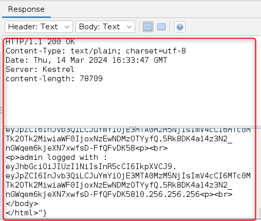 |
| CWE-319 | 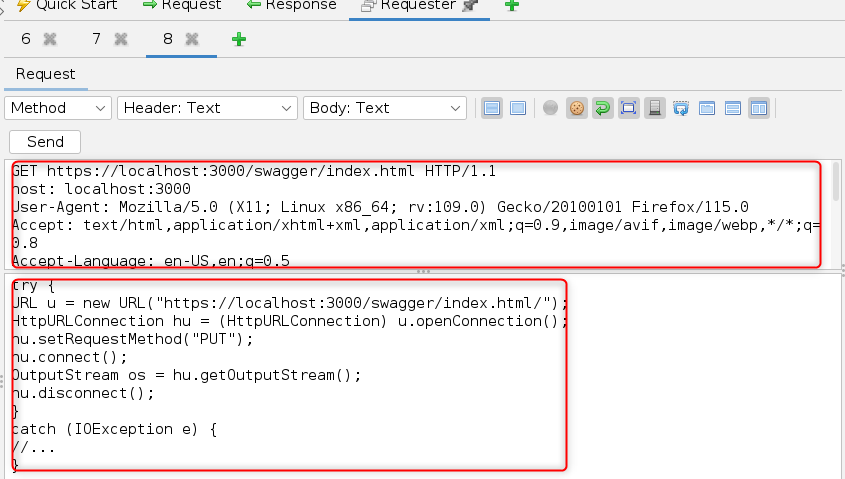 | 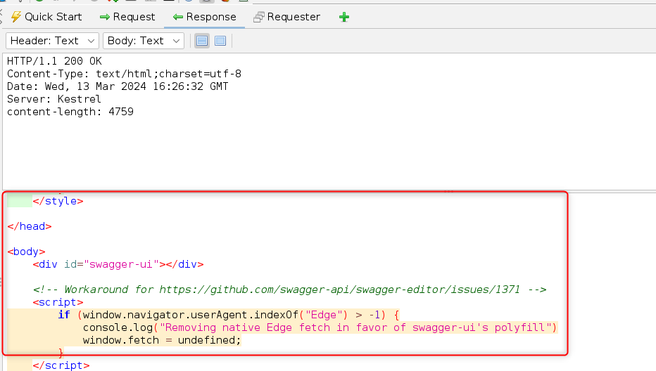 |
| CWE-434 | 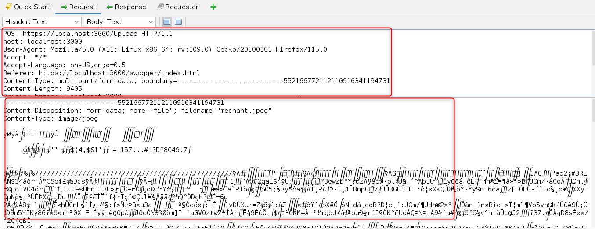 | 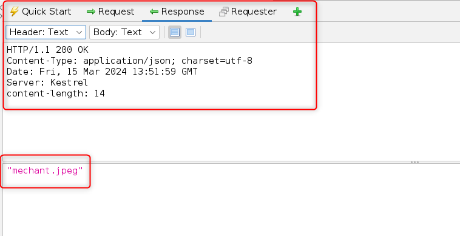 |
| CWE-502 | 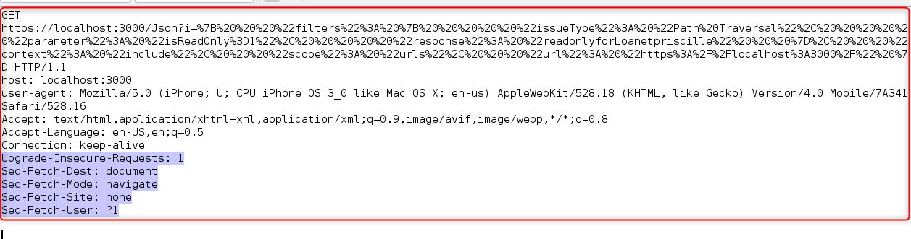 | 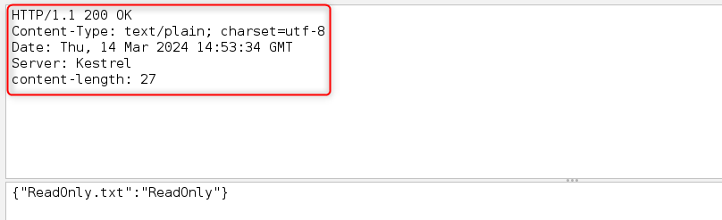 |
| CWE 639 | 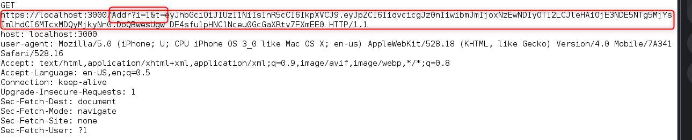 |  |
| CWE-798 | 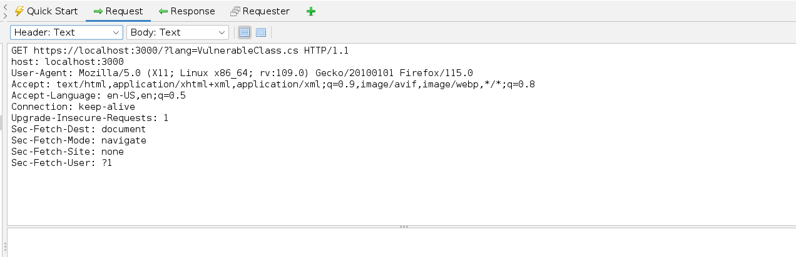 | 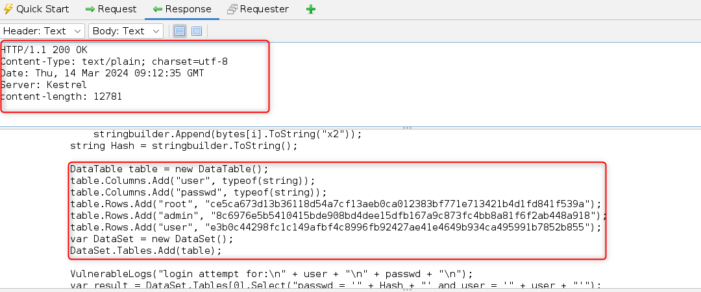 |
| CWE-918 | 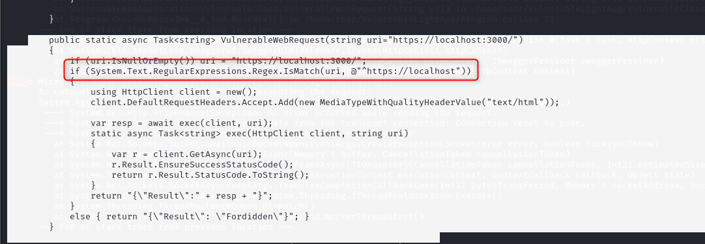 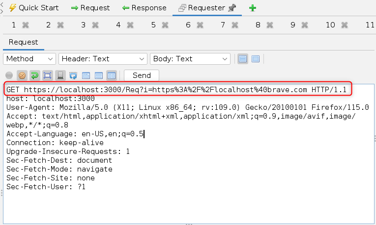 | 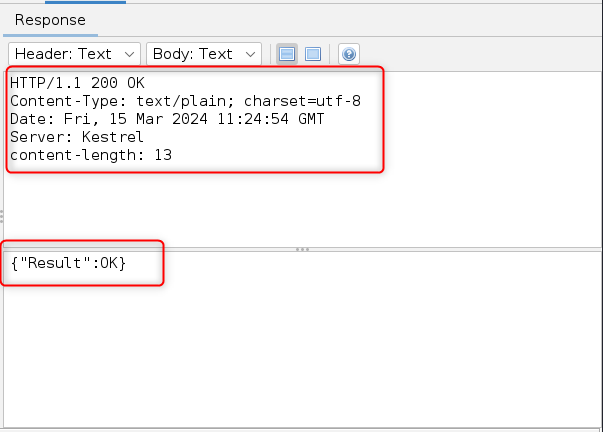 |

## 3. Description

| CWE | Description |
|:---:|:------------|
| CWE-23 | The product uses external input to construct a pathname that should be within a restricted directory, but it does not properly neutralize sequences such as ".." that can resolve to a location that is outside of that directory. |
| CWE-78 | The product constructs all or part of an OS command using externally-influenced input from an upstream component, but it does not neutralize or incorrectly neutralizes special elements that could modify the intended OS command when it is sent to a downstream component. |
| CWE-79 | The product does not neutralize or incorrectly neutralizes user-controllable input before it is placed in output that is used as a web page that is served to other users. |
| CWE-89 | The product constructs all or part of an SQL command using externally-influenced input from an upstream component, but it does not neutralize or incorrectly neutralizes special elements that could modify the intended SQL command when it is sent to a downstream component. |
| CWE-94 | The product constructs all or part of a code segment using externally-influenced input from an upstream component, but it does not neutralize or incorrectly neutralizes special elements that could modify the syntax or behavior of the intended code segment. |
| CWE-91 | The product does not properly neutralize special elements that are used in XML, allowing attackers to modify the syntax, content, or commands of the XML before it is processed by an end system. | 
| CWE-200 | The product exposes sensitive information to an actor that is not explicitly authorized to have access to that information. |
| CWE-284 | The product does not restrict or incorrectly restricts access to a resource from an unauthorized actor. |
| CWE-287 | When an actor claims to have a given identity, the product does not prove or insufficiently proves that the claim is correct. |
| CWE-319 | The product transmits sensitive or security-critical data in cleartext in a communication channel that can be sniffed by unauthorized actors. |
| CWE-434 | The product allows the attacker to upload or transfer files of dangerous types that can be automatically processed within the product's environment. |  
| CWE-502 | The product deserializes untrusted data without sufficiently verifying that the resulting data will be valid. |
| CWE 639 | The system's authorization functionality does not prevent one user from gaining access to another user's data or record by modifying the key value identifying the data. |
| CWE-798 | The product contains hard-coded credentials, such as a password or cryptographic key, which it uses for its own inbound authentication, outbound communication to external components, or encryption of internal data. |
| CWE-918 | The web server receives a URL or similar request from an upstream component and retrieves the contents of this URL, but it does not sufficiently ensure that the request is being sent to the expected destination. |

## 4. Recommendation

| CWE | Recommendation |
|:---:|:---------------|
| CWE-23 | Rigorously validate user input, use secure settings, and properly drop special characters to avoid malicious code injection. |
| CWE-78 | Avoid directly embedding unvalidated user input into system commands without properly filtering or escaping them. Use secure process management mechanisms, such as API functions or libraries that allow arguments to be passed securely, or parameterized queries in database environments, to prevent execution of unwarranted system commands. authorized. |
| CWE-79 | Properly validate and escape all dynamic data before displaying it on a web page to prevent malicious script injection. |
| CWE-89 | Use parameterized queries or secure Object-Relational Mapping (ORM)[^2] to interact with the database to avoid malicious SQL injection. |
| CWE-94 | Rigorously validate all user input and properly escape special characters to avoid injecting malicious code into your application. Use secure mechanisms such as parameterized queries or API functions that avoid direct incorporation of user input into executable code |
| CWE-91 | Avoid embedding unvalidated or unfiltered data in XML documents, especially in XML requests or dynamically generated responses. Instead, use secure functions and methods to construct and manipulate XML documents, making sure to properly escape special characters to prevent malicious injections. |
| CWE-200 | Ensure that you are not inappropriately exposing sensitive information such as usernames, passwords, API keys or personal data in logs, error messages, HTTP responses or any other communication channels. communication. Implement appropriate masking or encryption mechanisms to protect this information from unauthorized access. |
| CWE-284 | Make sure you have appropriate access controls in place to restrict access to sensitive resources based on user privileges and roles. Use robust authentication and authorization mechanisms to ensure that only authorized users can access sensitive features or data. |
| CWE-287 | Be sure to implement robust authentication mechanisms, such as session management, secure hashing functions for passwords, use of secure authentication tokens, and multi-factor verification, so ensure that only authorized users have access to sensitive features or data. |
| CWE-319 | Always use secure communication protocols such as HTTPS instead of HTTP to transmit sensitive information to encrypt data and prevent unauthorized interception. |
| CWE-434 | Strictly limit the types of files allowed to be downloaded to the system and use antivirus scanners to detect and block malicious files. |
| CWE-502 | Avoid deserializing data from untrusted or insecure sources. If deserialization is necessary, use secure mechanisms such as data validation, secure serialization, or secure libraries to limit the risk of malicious code execution during deserialization. |
| CWE 639 | Avoid using user-controlled values, such as query parameters or cookies, as keys to control authorization. Instead, use robust authentication and authorization mechanisms that do not rely on user-provided data to make resource access decisions. |
| CWE-798 | Avoid including login credentials or authentication information directly in the source code. Instead, use secure mechanisms like secret managers or protected external configuration files to store and retrieve this information securely. |
| CWE-918 | Validate and strictly limit user-provided URLs to ensure they cannot be used to make unauthorized requests to sensitive internal or external resources. Use whitelists of allowed IP addresses or URLs where possible, and be sure to implement appropriate access controls to restrict requests to legitimate, authorized resources. |

---
## 5. Sources

- [Common Weakness Enumeration](https://cwe.mitre.org/index.html)
- [Vulnerable Light APP](https://github.com/Aif4thah/VulnerableLightApp)

---

By Dao and Loan.

---
[^1]: Vulnerability added but not requested.
[^2]: Is a programming technique for converting data between a relational database and the heap of an object-oriented programming language.
