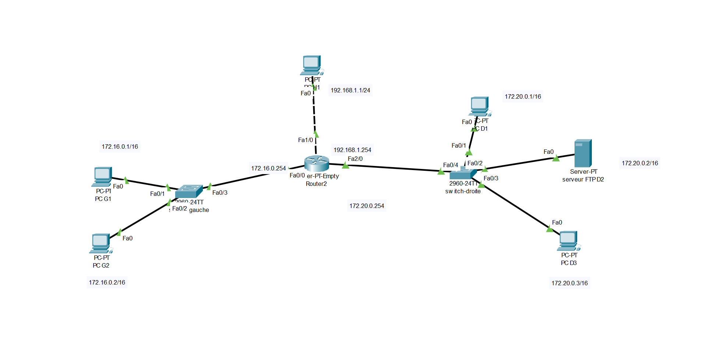
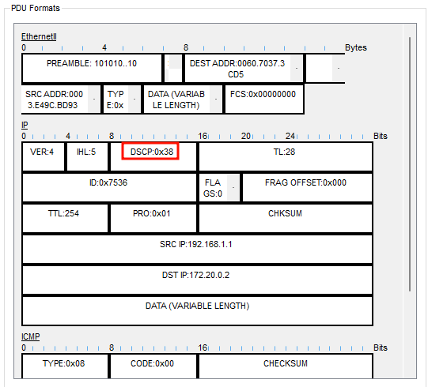
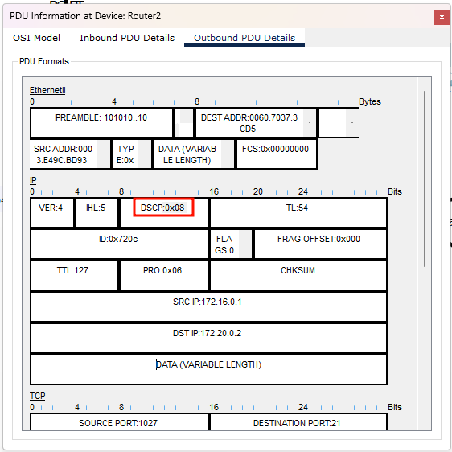

# QoS
---

## A. Mise en place et analyse de l’infrastructure

### Topologie



### Analyse
- Interface fa2/0 (vers le réseau droit)
    - Appliquer une politique QoS pour gérer la priorité des flux sortants
- Interface fa1/0 (depuis le PC H1)
    - Les flux entrants seront toujours prioritaires
- Serveur FTP (IP 172.20.0.2)
    - Réduire la priorité des flux FTP en direction de ce serveur

### Contexte
Le routeur 2811 central présente un goulot d'étranglement pour les flux se dirigeant vers la partie
droite du réseau, qui inclut un serveur FTP

### Objectif
Implémenter une politique de Qualité de Service (QoS) sur l'interface fa0/1 du routeur pour gérer la
priorisation des flux de données

### Stratégie
- Priorité haute
    - Les flux entrants par l'interface fa1/0 (provenant du PC H1) recevront une priorité élevée, indépendamment de leur nature
- Priorité basse
    - Les flux FTP à destination du serveur FTP (IP 172.20.0.2) seront classés avec une priorité basse pour éviter qu'ils n'encombrent le réseau

### Procédure générale
1. Définir une ou plusieurs classes de flux, en fonction de paramètres divers (ex : le protocole
concerné par le flux)
2. Définir une politique de QoS dans laquelle chaque classe de flux se voit attribuer un niveau de
priorité
3. Appliquer cette politique sur une interface, en entrée ou en sortie

## B. La QoS n’est pas activée

Dans cette exemple, télécharger un fichier binaire du serveur FTP à partir des deux postes G1 et H1 en
mesurant le débit de chacun des téléchargements (ou bien le temps nécessaire au téléchargement).

En l’absence de la Qos, le temps de téléchargement sera identique sur les deux postes.

Manipulations :
- À partir du poste G1
- Vérifier la connectivité avec le seveur FTP (commande ping).
- Ouvrir l’invite de commande et lancer une connexion ftp avec la commande suivante :

`ftp 172.20.0.2 (user : cisco, password : cisco)`

- Refaire la même manipulation à partir du poste **H1**.
- Une fois les deux postes G1 et H1 connectés au serveur FTP, lancer simultanément les deux téléchargements du fichier binaire suivant :

`ftp > get c1841-advipservicesk9-mz.124-15.T1.bin`

- Sur le routeur, vérifier les débits de l’interface Fa0/1 avec la commande suivante :

`Router# show interfaces fa 0/1`

## C. La QoS est activée en fonction de l’interface source

### Phase 1 - Déclarer les classes de flux

- Sur le routeur, déclarer une classe "prio-sur-interface"
    - Pour appartenir à cette classe, le flux doit provenir exclusivement de l'interface fa1/0
    - La clause "match-all" indique que, pour appartenir à la classe, un paquet doit vérifier tous les critères déclarés
    - La clause "match-any" signifie qu'il faut en vérifier au moins un
    - Si on ne déclare qu'un seul critère d'appartenance, "match-all" et "match-any" sont équivalents

```
Router# configure terminal
Router(config)#class-map match-all prio-sur-interface
Router(config-cmap)#match input-interface fa1/0
Router(config-cmap)#exit
```

- On peut vérifier la déclaration de la classe par la commande "show class-map"

```
Router# show class-map
    Class Map match-any class-default (id 0)
    Match any
    Class Map match-all prio-sur-interface (id 1)
    Match input-interface FastEthernet1/0
```

- On voit qu'il y a une classe par défaut, "classe-default", dont font partie tous les paquets.

### Phase 2 – Déclarer une politique de QoS

```
Router (config)#policy-map ma-politique-qos
Router (config-pmap)#class prio-sur-interface
Router (config-pmap-c)#set ip dscp cs7
Router (config-pmap-c)#exit
Router (config-pmap)#exit
```

- Si la politique "ma-politique-qos" n'existait pas encore, elle est créée. Si elle existait, les
commandes "class" vont la compléter
- Une priorité sur champ DSCP est définie pour les paquets de la classe "prio-sur-interface" avec le code "cs7", équivalent à un DSCP de "111000" et donc une priorité haute de "7" (voir le tableau de correspondance code/DSCP plus bas)

### Phase 3 - Appliquer la politique de QoS sur une interface

```
Router(config)#interface fa2/0
Router(config-if)#service-policy output ma-politique-qos
Router(config-if)#exit
Router(config)#exit
```

- On a donc appliqué la politique consistant à attribuer une priorité haute aux flux qui étaient entrés par l'interface fa1/0. Les paquets correspondants voient leur champ DSCP passer à **"111000"** quand ils sortent par l'interface *fa2/0*.
- On peut vérifier la déclaration de la politique de QoS par la commande `show policy-map`

```
Router# show policy-map
Policy Map ma-politique-qos
Class prio-sur-interface
set ip dscp cs7
```

- On peut également vérifier que la priorisation en sortie d'interface fa0/1 a changé est qu'elle n'est plus en mode **"FIFO"**, mais en mode **"class-based queueing"**.

```
Router#sh interfaces fa2/0
FastEthernet2/0 is up, line protocol is up (connected)
  Hardware is Lance, address is 0003.e49c.bd93 (bia 0003.e49c.bd93)
  Internet address is 172.20.0.254/16
  MTU 1500 bytes, BW 100000 Kbit, DLY 100 usec,
     reliability 255/255, txload 1/255, rxload 1/255
  Encapsulation ARPA, loopback not set
  Full-duplex, 100Mb/s, media type is RJ45
  ARP type: ARPA, ARP Timeout 04:00:00, 
  Last input 00:00:08, output 00:00:05, output hang never
  Last clearing of "show interface" counters never
  Input queue: 0/75/0 (size/max/drops); Total output drops: 0
-->  Queueing strategy: Class-based queueing
  Output queue: 0/1000/64/0 (size/max total/threshold/drops)
     Conversations  0/0/256 (active/max active/max total)
     Reserved Conversations 1/1 (allocated/max allocated)
     Available Bandwidth 75000 kilobits/sec
  5 minute input rate 5820 bits/sec, 139 packets/sec
  5 minute output rate 1847 bits/sec, 44 packets/sec
     51852 packets input, 2125897 bytes, 0 no buffer
     Received 0 broadcasts, 0 runts, 0 giants, 0 throttles
     0 input errors, 0 CRC, 0 frame, 0 overrun, 0 ignored, 0 abort
     0 input packets with dribble condition detected
     16369 packets output, 654759 bytes, 0 underruns
     0 output errors, 0 collisions, 0 interface resets
     0 babbles, 0 late collision, 0 deferred
     0 lost carrier, 0 no carrier
     0 output buffer failures, 0 output buffers swapped out
```

### Note sur DSCP dans Cisco Packet Tracer

| OS (Dec) | TOS (Hex) | TOS (Bin) | TOS Precedence (Bin) | TOS Precedence (Dec) | TOS Precedence Name | TOS Delay flag | TOS Throughput flag | TOS Reliability flag | DSCP (Bin) | DSCP (Hex) | DSCP (Dec) | DSCP/PHB Class |
|:--------:|:--------:|:--------:|:--------:|:--------:|:--------:|:--------:|:--------:|:--------:|:--------:|:--------:|:--------:|:--------:|
| 0        | 0x00      | 00000000  | 000                  | 0                    | Routine             | 0              | 0                   | 0                    | 000000     | 0x00       | 0          | none           |
| 4        | 0x04      | 00000100  | 000                  | 0                    | Routine             | 0              | 0                   | 1                    | 000001     | 0x01       | 1          | none           |
| 8        | 0x08      | 00001000  | 000                  | 0                    | Routine             | 0              | 1                   | 0                    | 000010     | 0x02       | 2          | none           |
| 12       | 0x0C      | 00001100  | 000                  | 0                    | Routine             | 0              | 1                   | 1                    | 000011     | 0x03       | 3          | none           |
| 16       | 0x10      | 00010000  | 000                  | 0                    | Routine             | 1              | 0                   | 0                    | 000100     | 0x04       | 4          | none           |
| 32       | 0x20      | 00100000  | 001                  | 1                    | Priority            | 0              | 0                   | 0                    | 001000     | 0x08       | 8          | cs1            |
| 40       | 0x28      | 00101000  | 001                  | 1                    | Priority            | 0              | 1                   | 0                    | 001010     | 0x0A       | 10         | af11           |
| 48       | 0x30      | 00110000  | 001                  | 1                    | Priority            | 1              | 0                   | 0                    | 001100     | 0x0C       | 12         | af12           |
| 56       | 0x38      | 00111000  | 001                  | 1                    | Priority            | 1              | 1                   | 0                    | 001110     | 0x0E       | 14         | af13           |
| 64       | 0x40      | 01000000  | 010                  | 2                    | Immediate           | 0              | 0                   | 0                    | 010000     | 0x10       | 16         | cs2            |
| 72       | 0x48      | 01001000  | 010                  | 2                    | Immediate           | 0              | 1                   | 0                    | 010010     | 0x12       | 18         | af21           |
| 80       | 0x50      | 01010000  | 010                  | 2                    | Immediate           | 1              | 0                   | 0                    | 010100     | 0x14       | 20         | af22           |
| 88       | 0x58      | 01011000  | 010                  | 2                    | Immediate           | 1              | 1                   | 0                    | 010110     | 0x16       | 22         | af23           |
| 96       | 0x60      | 01100000  | 011                  | 3                    | Flash               | 0              | 0                   | 0                    | 011000     | 0x18       | 24         | cs3            |
| 104      | 0x68      | 01101000  | 011                  | 3                    | Flash               | 0              | 1                   | 0                    | 011010     | 0x1A       | 26         | af31           |
| 112      | 0x70      | 01110000  | 011                  | 3                    | Flash               | 1              | 0                   | 0                    | 011100     | 0x1C       | 28         | af32           |
| 120      | 0x78      | 01111000  | 011                  | 3                    | Flash               | 1              | 1                   | 0                    | 011110     | 0x1E       | 30         | af33           |
| 128      | 0x80      | 10000000  | 100                  | 4                    | FlashOverride       | 0              | 0                   | 0                    | 100000     | 0x20       | 32         | cs4            |
| 136      | 0x88      | 10001000  | 100                  | 4                    | FlashOverride       | 0              | 1                   | 0                    | 100010     | 0x22       | 34         | af41           |
| 144      | 0x90      | 10010000  | 100                  | 4                    | FlashOverride       | 1              | 0                   | 0                    | 100100     | 0x24       | 36         | af42           |
| 152      | 0x98      | 10011000  | 100                  | 4                    | FlashOverride       | 1              | 1                   | 0                    | 100110     | 0x26       | 38         | af43           |
| 160      | 0xA0      | 10100000  | 101                  | 5                    | Critical            | 0              | 0                   | 0                    | 101000     | 0x28       | 40         | cs5            |
| 176      | 0xB0      | 10110000  | 101                  | 5                    | Critical            | 1              | 0                   | 0                    | 101100     | 0x2C       | 44         | voice-admit    |
| 184      | 0xB8      | 10111000  | 101                  | 5                    | Critical            | 1              | 1                   | 0                    | 101110     | 0x2E       | 46         | ef             |
| 192      | 0xC0      | 11000000  | 110                  | 6                    | InterNetwork Control | 0             | 0                   | 0                    | 110000     | 0x30       | 48         | cs6            |
| 224      | 0xE0      | 11100000  | 111                  | 7                    | Network Control     | 0              | 0                   | 0                    | 111000     | 0x38       | 56         | cs7            |


### Vérification du marquage DSCP

En mode "simulation", si on envoie un paquet quelconque (ICMP par exemple) à partir du poste H1, le
paquet arrive dans le routeur par le port Fa1/0 et fait donc partie de la classe "prio-sur-interface". Il se
voit attribuer le code DSCP "111000".



Le code DSCP "0x**38**" donne "1110.0000". Si on retient les 6 bits de poids fort, on obtient bien "111000"*

### Procédure

Refaire la même manipulation précédente à partir du poste G1 et H1.

- Une fois les deux postes G1 et H1 connectés au serveur FTP, lancer simultanément les deux téléchargements du même fichier binaire :

`ftp>get c1841-advipservicesk9-mz.124-15.T1.bin`

- Sur le routeur, vérifier les débits de l’interface Fa0/1 avec la commande suivante :

`Router#show interfaces FastEthernet 0/1`

## D.QoS en fonction du protocole

### Déclaration de la classe de flux

- Déclarer la nouvelle classe de flux : "prio-sur-ftp"
    - Pour appartenir à cette classe, le flux doit être de protocole FTP, quelle que soit sa source IP ou son interface source

```
Router (config)#class-map match-all prio-sur-ftp
Router (config-cmap)#match protocol ftp
Router (config-cmap)#exit
```

### Elargissement de la politique de QoS

- Complèter la politique "ma-politique-qos" en ajoutant la classe "prio-sur-ftp" à laquelle on attribue une priorité basse de type "cs1"
    - Soit un DSCP "001000" correspondant à une priorité "1"

```
Router (config)#policy-map ma-politique-qos
Router (config-pmap)#class prio-sur-ftp
Router (config-pmap-c)#set ip dscp cs1
Router (config-pmap-c)#exit
```

### Notes

- La politique "ma-politique-qos" étant déjà associée en sortie à l'interface fa0/1, il n'est pas utile de la déclarer à nouveau
- On définit, via la commande "set ip dscp", un code à placer dans l'entête du paquet
- On pourrait également agir sur la priorité par la commande BANDWIDTH permettant de réserver une part de bande passante affectée à la classe de trafic :
    - directement en kilobits/seconde
    - par un pourcentage de la bande passante totale
    - par un pourcentage de la bande passante restante

*Exemple : réserver 10% de la bande passante au trafic FTP.*

```
Router(config)#policy-map autre-politique
Router(config-pmap)#class prio-sur-ftp
Router(config-pmap-c)#bandwidth percent 10
```

### Vérification du marquage DSCP

- En mode simulation, générer des flux FTP depuis le poste G1 vers le serveur FTP D2.

L'analyse du trafic en sortie du port fa2/0 ou en entrée du commutateur de droite donne :



Le champ DSCP est à "08" soit "0010.0000" (ce qui donne "001000", soit une priorité "1")

## E. Compléments - Eléments de QoS dans le langage Cisco IOS

### Liste des codes DSCP Cisco par défaut

- af11 Match packets with AF11 dscp (001010)
- af12 Match packets with AF12 dscp (001100)
- af13 Match packets with AF13 dscp (001110)
- af21 Match packets with AF21 dscp (010010)
- af22 Match packets with AF22 dscp (010100)
- af23 Match packets with AF23 dscp (010110)
- af31 Match packets with AF31 dscp (011010)
- af32 Match packets with AF32 dscp (011100)
- af33 Match packets with AF33 dscp (011110)
- af41 Match packets with AF41 dscp (100010)
- af42 Match packets with AF42 dscp (100100)
- af43 Match packets with AF43 dscp (100110)
- cs1 Match packets with CS1 (precedence 1) dscp (001000)
- cs2 Match packets with CS2 (precedence 2) dscp (010000)
- cs3 Match packets with CS3 (precedence 3) dscp (011000)
- cs4 Match packets with CS4 (precedence 4) dscp (100000)
- cs5 Match packets with CS5 (precedence 5) dscp (101000)
- cs6 Match packets with CS6 (precedence 6) dscp (110000)
- cs7 Match packets with CS7 (precedence 7) dscp (111000)
- default Match packets with default dscp (000000)
- ef Match packets with EF dscp (101110)

### Commande match

`Usage : match [clause] [paramètre]`

- Exemple :

`match protocol http`

### Clauses de classement de flux

|       Clause       |                                    Description                                        |
|:------------------:|:--------------------------------------------------------------------------------------|
|    access-group    | Flux correspondant à un ACL (depuis un réseau, une IP, vers un port applicatif, etc.) |
|         any        | Tous les paquets                                                                      |
|      class-map     | Flux appartenant déjà à une certaine autre classe                                     |
|         cos        | Flux doté d'un certain champ COS IEEE 802.1Q                                          |
| destinationaddress | Flux avec une certaine adresse MAC de destination                                     |
|  input-interface   | Flux entré par une certaine interface                                                 |
|         ip         | Flux doté d'une certaine adresse IP                                                   |
|      precedence    | Flux doté d'une certaine précédence (champ sur 3 bits) en IPV4 et IPV6                |
|       protocol     | Flux correspondant à un protocole donné                                               |
|      qos-group     | Flux appartenant à un certain groupe de QoS (de 0 à 1023)                             | 